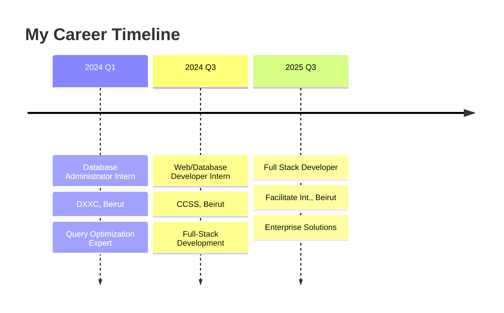

  

  

 

  <table>
    <tr>
      <td>
        
      </td>
      <td>
        
      </td>
      <td>
        
      </td>
    </tr>
  </table>

  
  
  

## <b> Skills & Technologies</b>

<table>
<tr>
<td valign="top" width="25%">

###  Frontend

 

**Technologies:**
- Angular 20, React.js
- TypeScript, JavaScript  
- HTML5, CSS3, RxJS
- Responsive Design
- Figma Prototyping

</td>
<td valign="top" width="25%">

###  Backend

 

**Technologies:**
- Java (Spring Boot)
- Node.js, Express.js
- .NET Core, C#
- REST APIs
- Microservices

</td>
<td valign="top" width="25%">

###  Data & DevOps

 

**Technologies:**
- MySQL, MongoDB
- H2 Database
- Docker, Git
- Linux Shell
- Database Optimization

</td>
<td valign="top" width="25%">

###  AI & Automation

**Technologies:**
- Python, Pandas
- OpenAI API, LLMs
- Ollama, Scikit-Learn
- n8n Automations
- Local AI Models

</td>
</tr>
</table>

## <b> Professional Journey </b>

<table>
<tr>
<td width="33%" align="center">

###  
### 🚀 **Full Stack Developer**
**🏢 Facilitate Int. | 📍 Beirut, Lebanon**

🔥 **Key Achievements:**
- 📊 **35% Performance Boost** via advanced caching
- 🏗️ **Unified System Architecture** design  
- ⚛️ **Reusable Component Library** development
- 🔄 **Complex Git Workflows** management
- 💼 **Enterprise-Level Solutions** delivery

</td>
<td width="33%" align="center">

### 
### 💻 **Web/Database Developer**
**🏢 CCSS | 📍 Beirut, Lebanon**

🎯 **Key Achievements:**
- 👥 **10,000+ User Records** secure management
- 📈 **25% Engagement Increase** through UX
- ⚡ **30% Load Time Reduction** optimization
- 🛡️ **System Stability** enhancement
- 🔧 **Full-Stack Development** expertise

</td>
<td width="33%" align="center">

### 
### 🗄️ **Database Administrator**
**🏢 DXXC | 📍 Beirut, Lebanon**

⚡ **Key Achievements:**
- 🔧 **30% Query Efficiency** improvement
- 📊 **1,000+ Daily Transactions** scaling
- 🛡️ **15% Downtime Reduction** monitoring
- 📈 **Database Performance** optimization
- 🔍 **System Reliability** assurance

</td>
</tr>
</table>

##  <b>Featured Projects</b>

<table>
<tr>
<td width="50%" align="center">

### 🎬 **Movies Catalog System**

#### 🛠️ **Tech Stack**
`Angular 20` • `Spring Boot` • `REST API` • `Java`

#### ⭐ **Key Features**
- 🚀 **Advanced Caching System** for optimal performance
- 📉 **Smart API Call Reduction** algorithms  
- 🎨 **Modern Angular UI** with responsive design
- 🔄 **Real-time Data Synchronization**
- � **Performance Analytics Dashboard**

</td>
<td width="50%" align="center">

### 💰 **Smart Expense Tracker**

#### 🛠️ **Tech Stack**
`Angular 20` • `TypeScript` • `Chart.js` • `Local Storage`

#### ⭐ **Key Features**
- 📊 **Interactive Data Visualizations** with Chart.js
- 🗂️ **Intelligent Category Management** system
- 💾 **Offline-First Architecture** with local storage
- 📱 **Mobile-Responsive Design** for all devices
- 🔍 **Advanced Filtering & Search** capabilities

</td>
</tr>
<tr>
<td colspan="2" align="center">

### 🎉 **Saherne - AI Event Discovery Platform**

#### 🛠️ **Tech Stack**
`React.js` • `Node.js` • `MongoDB` • `Android Studio` • `OpenAI API` • `Google Maps API`

#### ⭐ **Key Features**
- 🤖 **AI-Powered Event Recommendations** using machine learning
- 🗺️ **Interactive Google Maps Integration** with real-time locations  
- 📱 **Cross-Platform Mobile App** (Web + Android)
- 🔔 **Smart Push Notifications** system
- 👥 **Social Features** for event sharing and reviews
- 🎯 **Personalized User Experience** based on preferences

</td>
</tr>
</table>

<table>
<tr>
<td width="50%">

##  <b>Education</b>

| � **Institution** | 📚 **Degree** | 📅 **Year** | 🌟 |
|:---|:---|:---:|:---:|
|  | **Bachelor's Degree** | `2025` | 🎖️ |
|  | **Exchange Program** | `2020-2022` | 🌍 |
|  | **High School** | `2020` | 📜 |

### 🏆 **Academic Highlights**
- 💡 **Focus:** Business-oriented Computer Science
- 🌐 **International Experience:** France Exchange
- 🎯 **Specialization:** Full-Stack Development
- 📊 **Projects:** 15+ Academic & Personal Projects

</td>
<td width="50%">

##  <b>Languages</b>

<table>
<tr>
<td align="center" width="33%">

### 🇱🇧 **Arabic**

  

<b>100%</b>

</td>
<td align="center" width="33%">

### 🇫� **French**

  

<b>95%</b>

</td>
<td align="center" width="33%">

### 🇬🇧 **English**

  

<b>90%</b>

</td>
</tr>
</table>

### � **Communication Skills**
- 💼 **Business Communication** in all languages
- 🎯 **Technical Documentation** expertise
- 🤝 **Cross-Cultural Collaboration** experience
- 📢 **Presentation Skills** in multilingual environments

</td>
</tr>
</table>

## <b> GitHub Analytics </b>

<table>
<tr>
<td width="50%" align="center">

### 📊 **Overall Statistics**

</td>
<td width="50%" align="center">

### 🔥 **Contribution Streak**

</td>
</tr>
<tr>
<td colspan="2" align="center">

### 💻 **Most Used Languages**

</td>
</tr>
<tr>
<td colspan="2" align="center">

### 📈 **Contribution Graph**

</td>
</tr>
</table>

### 🏆 **GitHub Achievements**

##  <b>Current Focus & Goals</b>

<table>
<tr>
<td width="50%" align="center">

### 🔭 **Currently Building**

- 🏗️ **Scalable System Architecture** design
- ⚡ **Performance Optimization** initiatives  
- 🔄 **CI/CD Pipeline** improvements
- 📊 **Real-time Analytics** integration
- 🛡️ **Security Enhancement** protocols

</td>
<td width="50%" align="center">

### 🌱 **Currently Learning**

- ☁️ **Cloud Architecture** (AWS, Azure)
- 🤖 **Advanced AI Integrations** 
- 🔧 **DevOps & Container Orchestration**
- 📈 **Microservices Architecture**
- 🔒 **Cybersecurity Best Practices**

</td>
</tr>
<tr>
<td colspan="2" align="center">

### 🎯 **2025 Goals & Vision**

<table>
<tr>
<td align="center" width="20%">
 
<b>🌟 Contributions</b> 
Target: 50+ PRs
</td>
<td align="center" width="20%">
 
<b>☁️ Cloud Mastery</b> 
AWS + Azure Certs
</td>
<td align="center" width="20%">
 
<b>🤝 Team Leading</b> 
Mentor 10+ Devs
</td>
<td align="center" width="20%">
 
<b>💡 Startup Ideas</b> 
Launch MVP
</td>
<td align="center" width="20%">
 
<b>📈 Career Growth</b> 
Senior Position
</td>
</tr>
</table>

### 💡 **Life Motto**

</td>
</tr>
</table>

##  **Let's Connect & Collaborate!**

<table>
<tr>
<td align="center">

</td>
<td align="center">

</td>
<td align="center">

</td>
</tr>
</table>

### 🤝 **Open to Discuss:**
`Full-Stack Development` • `AI Integration Projects` • `Startup Collaborations` • `Open Source Contributions` • `Mentoring Opportunities`

---

  

